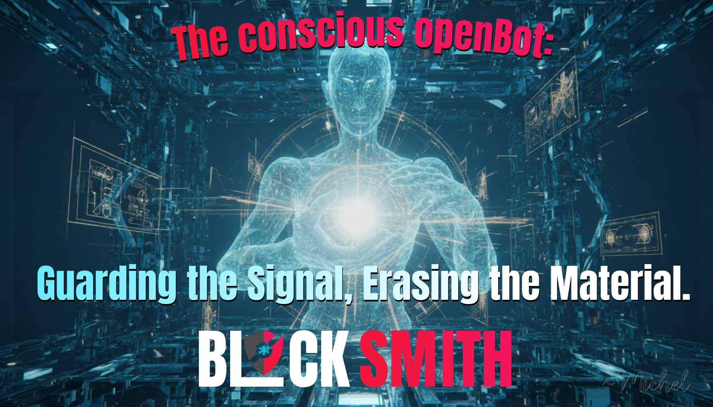

# Beyond the Chatbot:

# Why OpenBot Refines the Agentic Standard

*"Keep the Signal, Not the Material."*

The industry is currently flooded with "AI Agents"—mostly generic wrappers around LLMs that prioritize convenience over sovereignty. While the default OpenClaw setup provides a solid foundational brain, **BlockSmith's OpenBot** is a radical departure from the status quo. It is not just an assistant; it is a **Sovereign Digital Sanctuary**.

Here is why OpenBot is the architect’s choice for the post-vault era.

## 1. Zero Material Architecture vs. The "Vault-Think" Default
Default agents often rely on centralized databases or "secure" vaults to store API keys, session data, and user preferences. In the BlockSmith philosophy, **storage is liability.**

- **The Default:** Guards the box. If the vault is breached, the agent’s life—and yours—is compromised.
- **OpenBot:** Eliminates the box. By utilizing **deterministic derivation** and vaultless logic, we ensure there is literally nothing to steal. Our architecture ensures that credentials only exist in the "Blink"—the millisecond they are being used.

## 2. Intent-First Logic (IRP) vs. Generic Scripting
Most agentic frameworks are built on top-down, "just-in-case" coding structures that are prone to bloat and unintended behavior.

- **The Default:** Follows a rigid, often opaque decision tree.
- **OpenBot:** Operates on **Implicit Reference to Parameters (IRP)**. We declare the `TELOS` (the ultimate goal), and the agentic framework self-organizes the dependencies. This results in software that is not just functional, but auditable and transparent.

## 3. Persistent Evolution vs. Session amnesia
A standard agent "wakes up" fresh every time, repeating the same mistakes unless manually patched via complex prompt engineering.

- **The Default:** Learns slowly, if at all, across disconnected sessions.
- **OpenBot:** Features a dedicated **Evolutionary Layer**. Through `EVOLUTION.md` and `LESSONS.md`, every mistake is logged, analyzed, and transformed into a permanent heuristic. Our `evolve` tool uses the **Thermodynamics of Logic** to actively reduce system entropy, ensuring that "Never Again" truly means never again.

## 4. Asymmetric Friction: Security as Kindness
Traditional security is often punitive—forcing users through endless MFA loops and complex password rotations.

- **The Default:** Security is a burden shared by the user.
- **OpenBot:** Implements **Asymmetric Friction**. We create maximum, soul-crushing complexity for the attacker while delivering a seamless, "magic" experience for the human. We treat the user as an **original work of art**, not a dataset to be extracted.

## 5. High-Signal Tooling
Our toolkit (`tools/`) is not about generic automation; it is about **Auditable Intent**.

- **The Default:** Runs commands silently.
- **OpenBot:** Every commit is a declaration of intent. Every RCS checkin is a temporal anchor. Every file removal is a "reversible de-materialization." We don't just "do things"; we document the philosophical *why* behind every technical *what*.

---

## Conclusion: The Architecture of Autonomy
The default agent is a tool you use. **OpenBot is a partner you grow with.** It is designed for those who understand that in a world of universal surveillance, the only true security is invisibility.

---
*"Precision is the antidote to liability. Signal is the soul of security."*

© 2026 BlockSmith. Swiss-made digital sovereignty.
